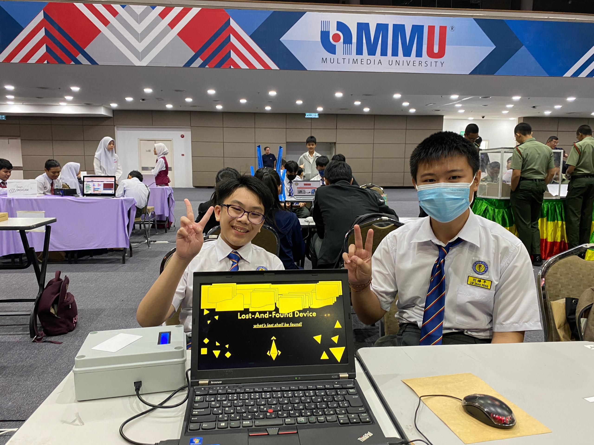

# 2024 project 
# LOST AND FOUND DEVICE 

this is the [slides for my project](https://docs.google.com/presentation/d/1LsE_PMOeUFkv4msau6G4VDjrV2jTqzi6rBFEL1geM7U) 

## this is list to teach you how to use my project

First, you has to download the file call RFID_v4.sb3,which will you see at the top 

Second, you will has to press the slide to access the code in slide 

therefore, you can use the code on pictoblox to try it out!!!

## The reason i build this project
I joined the Young Inventor Challenge for  the first time around this year because I was curious and wanted to learn something new.

I also had the opportunity to work on this project with my friend, Khim Teck, which made the experience more enjoyable and meaningful.

Although we did not win the competition, I learned a lot from the experience and became more interested in inventing and creating new things.

